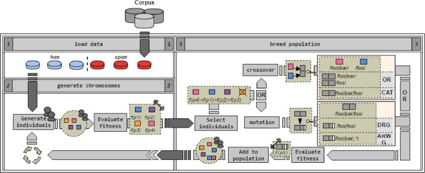

# DiscoverRegex
Automatic Generator of Regular Expressions.

## Required libraries

* libpcre3-dev

## Installation instructions

```
    make all
```
## Operation mode



## Execution example

```
    sh discoverRegex  
```

Achieved results are located at: results folder
